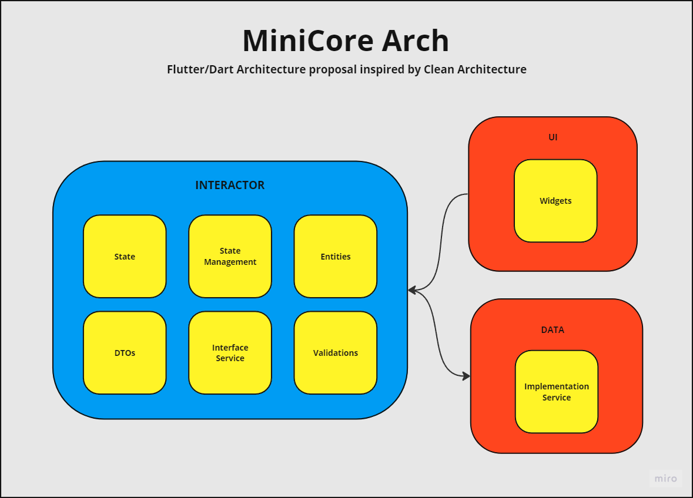
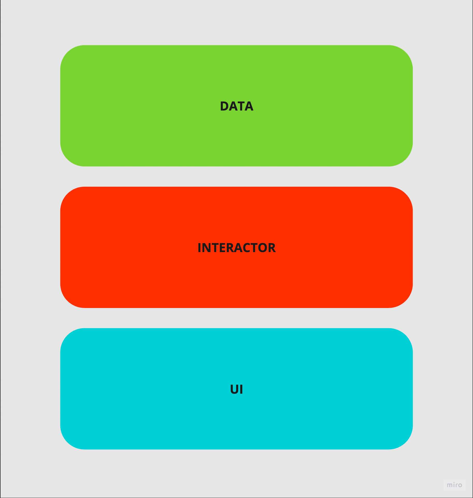

# MiniCore Arch
Flutter/Dart Architecture proposal inspired by Clean Architecture.




## Clean Dart proposal

- [pt-BR](1.0/README.md)
- [en-US](1.0/README_en.md)


# Start

Using Flutter as an example, we will then have three layers maintaining the “Plugin Architecture”, with the main focus on the State of the Application, which is the layer that hosts the events/actions for state changes.



The Architecture proposal proposes to decouple the outermost layers and preserve the Business Rule.


## UI

The **UI** Layer is responsible for declaring the application's inputs, outputs and interactions.

Using Flutter as an example, we will host the Widgets and Pages, in the backend as an example, it would be in this layer where we would place the Handlers or Commands of our API.


## INTERACTOR

The **Interactor** layer will host the application's Business Rules along with their states.
The core of the layer will be state elaboration and scheduling through some state management approach.

Taking a Repository as an example, we will only have to have the interfaces contract (Abstractions) and the responsibility for implementing this object will have to be transferred to another lower layer.


## DATA

This layer supports the **Interactor** layer by implementing its interfaces. To do this, it adapts external data so that it can fulfill the domain's contracts.

Most likely in this layer we will implement some Repository or Services interface that may or may not depend on external data such as an API or access to some Hardware such as Bluetooth.

In order for the Repository to be able to process and adapt external data, we must create contracts for these services in order to pass the implementation responsibility to the lowest layer of our architecture.

Basically, the **DATA** layer should contain everything that will have a high chance of being changed without the programmer being able to intervene directly in the project.

# Tips

## Modularize

Obviously we can keep our layers for the entire application but we can get more out of it by creating Interactor, Data and UI layers for each feature. Example:


```
module
├── data
│   ├── datasources
│   └── repositories
├── domain
│   ├── entities
│   └── usecases
└── presenter
    ├── stores
    ├── controllers
    ├── pages
    └── widgets
```

## Think by layer

When developing, start thinking by layer, we shouldn't worry about what's in the **UI** or **DATA** layer at the beginning of the functionality. If we think about the outermost layers, we can end up orienting ourselves (mistakenly) by these layers. Thus, we must get used to developing layer by layer, from the inside out and not the other way around.

Perhaps at the beginning of your "Clean" journey some layers may seem "useless", this happens when our mind is not yet **Thinking in Layers** (or because your Business Rule is too simple for that).

## Teste de Unidade será sua nova UI

É muito comum os desenvolvedores criarem primeiro as suas Views para que então possam "testar" as Regras de Negócio. Mas nós já temos uma ferramenta própria para isso e um lugar dedicado para armazenar esses testes.

Desenvolver de forma "limpa" está em total sinergia com o **TDD**(Test Driven Development) pois a camada de **UI** será uma das últimas coisas que iremos pensar no desenvolvimento da nossa feature.


# Assine!

Apreciamos o seu feedback!
Se concorda com a proposta de Arquitetura Limpa "Clean Dart", deixe uma **Star** neste repositório. Uma **Star** é o mesmo que assinar um "manifesto limpo" concordando com essa proposta.

Estamos abertos a sugestões e melhorias na documentação!
Faça isso por meio das [issues](https://github.com/Flutterando/Clean-Dart/issues), nossa equipe ficará muito contente com seu interesse em melhorar essa ferramenta para a comunidade.

Sinta-se a vontade para abrir um **PR** com correções na documentação dessa proposta.

# Exemplos

- [Clean Dart Burgers Cart using BLoC, Cubit, Triple, Asp, MobX, etc](https://github.com/jacobaraujo7/bloc_atom)
- Clean Dart Login with Firebase, MobX and Modular
- [Clean Dart Github Search with BLoC and Modular](https://github.com/Flutterando/clean-dart-search-bloc)
- [Clean Dart Github Search with MobX and Modular](https://github.com/jacobaraujo7/clean-dart-search-mobx)

# Links úteis

- [Resumo do livro "Arquitetura Limpa"](https://medium.com/@deividchari/desvendando-a-arquitetura-limpa-de-uncle-bob-3e60d9aa9cce)
- [Sua Arquitetura está limpa?](https://medium.com/flutterando/sua-arquitetura-est%C3%A1-limpa-clean-architecture-no-flutter-458c68fad120)
- [Os tijolos do Clean Architecture](https://www.youtube.com/watch?v=C8mpy3pwqQc)
- [The Clean Code Blog](https://blog.cleancoder.com/uncle-bob/2012/08/13/the-clean-architecture.html)

